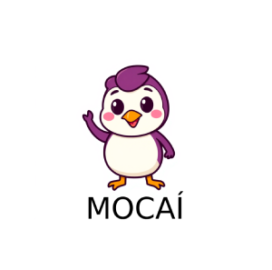

# Mocai

Uma biblioteca Go para geração de dados de teste, permitindo criar mocks de entidades de forma simples e eficiente.
 
## 🚀 Descrição

**Mocaí** é uma biblioteca em Go para geração de mocks de entidades, como Pessoa, Endereço, Telefone e outras. Ela foi criada para facilitar o desenvolvimento e teste de aplicações, fornecendo dados aleatórios e consistentes para simular cenários reais.

---
[Linkedin](https://www.linkedin.com/in/wellitonfernandes/)