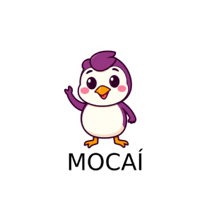

# Mocai



Uma biblioteca Go para geração de dados de teste, permitindo criar mocks de entidades de forma simples e eficiente.
 
## 📖 Descrição

**Mocaí** é uma biblioteca open-source em Go projetada para simplificar a geração de mocks de entidades como Pessoa, Endereço, Telefone e muitas outras. Nosso objetivo é tornar o desenvolvimento e teste de aplicações mais eficiente, fornecendo dados aleatórios, porém consistentes, que simulam cenários reais de forma prática e confiável.

## 🌟 Curiosidade sobre o Nome
O nome Mocai é uma homenagem à iniciativa brasileira por trás da biblioteca. Ele surgiu da combinação de "mock" (termo em inglês para simulação ou dados fictícios) com "açaí", uma fruta típica da Amazônia brasileira, conhecida por sua energia e versatilidade. Assim como o açaí é essencial para muitos brasileiros, o Mocai busca ser uma ferramenta essencial para desenvolvedores que precisam de dados de teste eficientes e de qualidade. 🇧🇷

## 🛠️ Principais Recursos

- Geração de Dados Aleatórios: Crie mocks de entidades com dados variados e realistas.
- Consistência: Garanta que os dados gerados sejam consistentes e adequados para testes.
- Facilidade de Uso: Interface simples e intuitiva para integração rápida em seus projetos.
- Extensibilidade: Adicione novas entidades ou personalize as existentes conforme suas necessidades.
- Open Source: Colabore, sugira melhorias e contribua para o crescimento da biblioteca.

## 🚀 Por que usar o Mocai?
- Produtividade: Reduza o tempo gasto na criação de dados de teste.
- Qualidade: Melhore a cobertura e a eficácia dos seus testes com dados realistas.
- Flexibilidade: Adapte os mocks às necessidades específicas do seu projeto.
- Comunidade: Faça parte de uma comunidade open-source que valoriza a colaboração e a inovação.


## 🚀 Como Começar
### Instalação
Para começar a usar o Mocai, instale a biblioteca com o seguinte comando:

```
go get github.com/wellfernandes/mocai
```

Uso Básico
Importe a biblioteca em seu projeto e comece a gerar mocks:

```
package main

import (
    "fmt"
    "github.com/wellfernandes/mocai/pkg/mocai"
)

func main() {
    // Gerar um mock em português (pt-br)
    mock := mocai.GenerateMocai("pt-br")

    fmt.Println("Pessoa:", mock.Person.FirstName, mock.Person.LastName)
    fmt.Println("Endereço:", mock.Address.Street, mock.Address.Number)
    fmt.Println("Telefone:", mock.Phone.AreaCode, mock.Phone.Number)
}
```

### Exemplos
A pasta ***examples*** contém exemplos de como usar a biblioteca. Para executar os exemplos, navegue até a pasta e execute:

```
cd examples
go run main.go
```

## 🤝 Contribua
O Mocai é um projeto open-source, e sua contribuição é muito bem-vinda! Seja reportando bugs, sugerindo novas funcionalidades ou enviando pull requests, sua participação ajuda a melhorar a biblioteca para todos.

### Como Contribuir
1. **Reporte Problemas:** Encontrou um bug ou tem uma sugestão? Abra uma issue.

2. **Envie Pull Requests:** Siga as diretrizes de contribuição e envie suas melhorias.

3. **Discuta Ideias:** Participe das discussões e compartilhe suas ideias para o projeto.

### Diretrizes de Contribuição
1. Siga o padrão de código do projeto.
2. Adicione testes para novas funcionalidades.
3. Documente suas alterações no **README.md**.

## 📄 Licença
O Mocai é distribuído sob a **licença MIT**.

### 🌟 Mocai: Gerando mocks, simplificando testes, acelerando desenvolvimento.
Seja bem-vindo ao projeto e sinta-se à vontade para explorar, usar e contribuir!

## 🌐 Servidor no Discord
Participe do servidor **Mocai** no Discord:
[Clique aqui e junte-se a nós!](https://discord.gg/TFRnQBkAMt)
